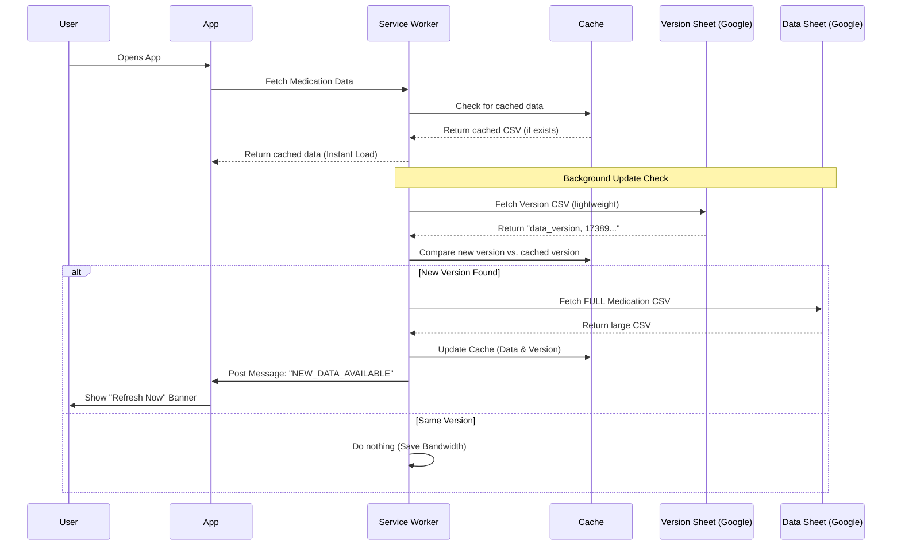

# Architecture Reference

## Overview
The **Formulari Ubat PKD Kuala Langat** app is a **Progressive Web Application (PWA)** designed to be an offline-first, high-performance reference tool for healthcare professionals. 

## Project Directory Structure

```text
/
├── public/                 # Static assets copied directly to dist/
│   ├── service-worker.js   # Background sync, caching, and update logic
│   ├── manifest.json       # PWA metadata (icons, theme, start_url)
│   └── assets/             # Favicons and PWA icons
├── src/                    # Source code
│   ├── components/         # React UI components
│   ├── hooks/              # Custom React hooks (Data fetching)
│   ├── utils/              # Helper functions (CSV parsing, Analytics)
│   ├── styles/             # Global CSS with variables
│   ├── App.jsx             # Main App controller and layout
│   └── main.jsx            # React entry point & SW registration
├── tests/                  # Unit and E2E (Cypress) tests
├── ARCHITECTURE.md         # System design reference
├── DOCUMENTATION.md        # Maintenance and developer guide
├── package.json            # Dependencies and scripts
└── vite.config.js          # Build tool configuration
```

It utilizes a **Serverless** architecture where Google Sheets acts as the database and CMS (Content Management System). The frontend is a static React application built with Vite, which fetches data directly from the published CSV export of the Google Sheet.

## System Design

### High-Level Components

1.  **Client (React App):** A Single Page Application (SPA) that renders the UI and manages user interaction.
2.  **Service Worker (The Proxy):** A custom JavaScript worker that sits between the Client and the Network. It handles caching, offline requests, and background update checks.
3.  **Database (Google Sheets):**
    *   **Sheet A (Data):** Contains the full list of medications (300KB+).
    *   **Sheet B (Version):** Contains a tiny metadata row with a Unix timestamp (50 bytes).

### Data Flow & Caching Strategy

The application implements a custom **"Two-Step Stale-While-Revalidate"** strategy to minimize bandwidth usage while ensuring data freshness.



## Core Architectural Patterns

### 1. Offline-First via Service Worker
The Service Worker (`public/service-worker.js`) is the critical backbone of the architecture.
*   **Interception:** It intercepts all network requests.
*   **Asset Caching:** Caches HTML, CSS, JS, and Fonts for offline UI rendering.
*   **Data Caching:** Caches the parsed Google Sheet CSV.
*   **Resilience:** If the network is down, the app works 100% using the cache.

### 2. "Two-Step" Update Mechanism
To solve the "Sync Jitter" problem common with Google Sheets (where servers return cached/older versions randomly) and to save data:
1.  **Step 1:** The app checks a dedicated **Version Sheet** first. This response is extremely small (<100 bytes).
2.  **Step 2:** It parses a `data_version` Unix timestamp.
3.  **Step 3:** Only if `NetworkVersion > CachedVersion` does it initiate the download of the heavy main database.
4.  **Step 4:** Once the new data is cached, the Service Worker sends a `NEW_DATA_AVAILABLE` message to the Client.
5.  **Step 5:** The React App (`App.jsx`) receives this message and displays a sticky "Refresh Now" banner to the user.

### 3. Client-Side Search
*   **Library:** [Fuse.js](https://fusejs.io/)
*   **Mechanism:** The entire CSV is parsed into a JSON array in memory. Search happens purely on the client device.
*   **Benefit:** Zero latency search results, works offline, no API rate limits.

### 4. Zero-Build Data Deployment
The content of the app can be updated **without rebuilding or redeploying the code**.
*   **Code Changes:** Require a build (`npm run build`) and deployment.
*   **Content Changes:** Done by pharmacists in Google Sheets. The app automatically detects the new timestamp and pulls the data.

## Technology Stack

*   **Runtime:** Browser (Client-side only)
*   **Framework:** React 19
*   **Build Tool:** Vite
*   **Language:** JavaScript (ESModules)
*   **Styling:** CSS3 (Variables for Theming)
*   **State Management:** React `useState` / `useEffect`
*   **Persistence:** `localStorage` (User preferences, Recent History) + `Cache Storage API` (Service Worker)
